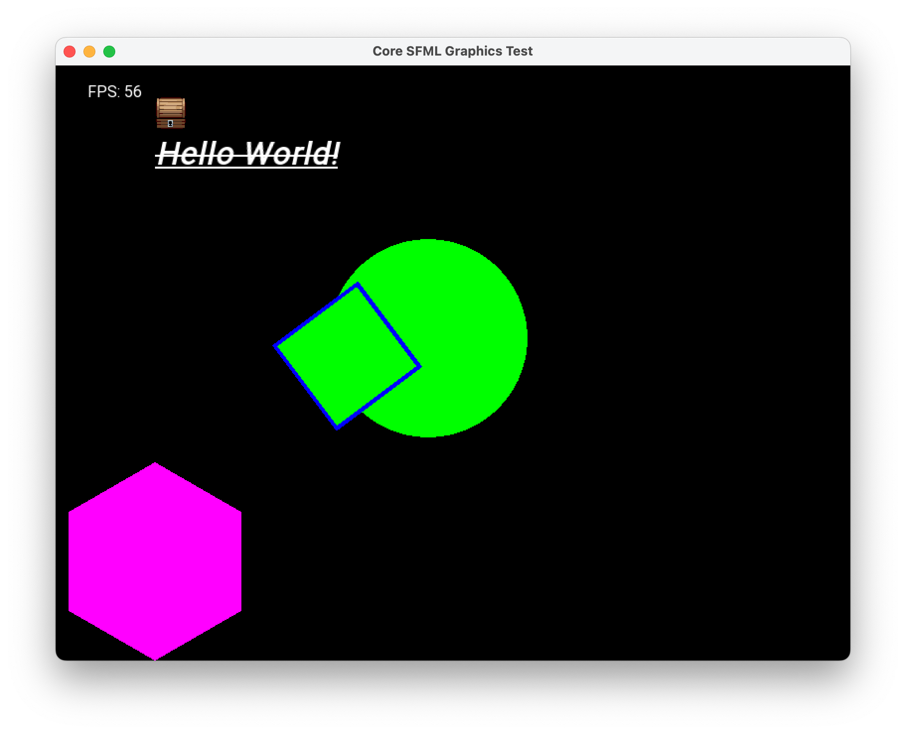

# sfcg - SFML Core Graphics Module

My attempt to implement most of SFML Graphics API in OpenGL Core profile without usage of any legacy API.

Experimental, WIP, and probably broken.

## Features



My aim is to have fully-working, API-compatible and documented replacement for SFML graphics, although it's still far from that. As for now, the following features are implemented:

- Creation of render window, with given context settings
- Drawing of rectangles, circles, and convex shapes
- Sprites
- Text rendering using `sf::Font`

See [example](example/main.cpp) for usage.

## Why?

I wanted to make an educational 3D pet-project with modern (core) OpenGL using SFML, but unfortunately, as for now, SFML Graphics module uses legacy OpenGL API, which I also couldn't run on my MacOS with M1 chip. At the same time, being a big fan of SFML clean and elegant API, I didn't want to switch to another library or introduce another dependency to my project. Therefore, I decided to write a drop-in replacement for SFML Graphics module, which would use modern OpenGL API.

## How to use

**Most of APIs from SFML have 1-1 mapping, just change the namespace from `sf::` to `sfcg::`.**

Please note, not all classes or definitions were re-implemented, some SFML classes are completely good or independent of OpenGL context version, like `sf::Vertex` or `sf::Vector2f`. Therefore, they are not included in this library and `sfcg` is still dependent on `sfml-graphics`, so do not forget to link against it.

1. Add the library to your project (for now it has to be built manually, will be fixed later)
2. Include the header file: `#include <sfcg/SFCG.hpp>`, which will include all the necessary headers (or include them separately)
3. Create a RenderWindow with context settings, that will enable OpenGL Core profile, for example like this:

```cpp
sf::ContextSettings settings;
settings.attributeFlags = sf::ContextSettings::Core;
settings.majorVersion = 4;
settings.minorVersion = 1;

sfcg::RenderWindow window(sf::VideoMode(800, 600), "App", sf::Style::Default, settings);
```

4. Call `sfcg::init()` to initialize some internal library stuff - mainly `sfcg::GeometryCache` which has re-usable VBOs, VAOs and shaders. This may be subject to change. Make sure you call it when OpenGL context is already created.

5. Use the library as you would use SFML Graphics module, for example:

```cpp
sfcg::RectangleShape rect(sf::Vector2f(100,100));
rect.setFillColor(sf::Color::Red);
rect.setPosition(100, 100);

//in event loop, between window.clear() and window.display()
window.draw(rect);

```

6. Call `sfcg::cleanup()` before exiting the program to free all the resources.

## Known Issues

First of all, keep in mind that I am relatively newbie in OpenGL and even C++, therefore the code may be broken, inefficient, or just plain wrong. I would be very grateful for any feedback, suggestions, or pull requests.

Secondly, due to fact that we have to send all the data to GPU before rendering, the codebase contains some experiments for getting a good compromise between performance and API simplicity.

For example, `sfcg::RectangleShape` by itself does not create any VBOs or VAOs. Instead there is `sfcg::GeometryCache` singleton class, which creates a unit (1x1) rectangle VBO and VAO, that are later scaled to needed size in vertex shader. This is done to avoid creating a new VBO for every rectangle, if user decides to create hundreds of them. Such approach also applies to circle shape. At the same time, this is tricky, does not work well with outlines, so it will probably be changed in future.

Due to what was said before and other circumstances, some of the features from SFML may work with issues:

- Not all APIs are fully 1-1 compatible with SFML or even implemented, see the TODO below
- Code may not work well on all platforms - for simplicity purposes, there are no checks for OpenGL extensions, assuming all needed extensions are already available
- Some approaches or code parts may be experimental
- Shapes, other than rectangles, may not work well with outlines

Long story short:

### ⚠️ This started as personal educational project, so no guarantees are given. Use at your own risk. ⚠️

## TODO:

- [x] `sf::Texture` (use SFML variant)
- [x] `sf::Sprite -> sfcg::Sprite`
- [ ] `sf::RenderTexture`
- [x] `sf::RenderTarget`
- [x] `sf::RenderWindow`
- [x] `sf::Shader` (needs more uniform setters)
- [x] `sf::Font` (use SFML variant)
- [x] `sf::Text`
- [ ] `sf::VertexArray` (TBD regarding the API)
- [ ] `sf::VertexBuffer` (missing copy constructor)
- [x] `sf::RectangleShape`
- [x] `sf::CircleShape`
- [x] `sf::ConvexShape`
- [ ] Switching between different render targets
- [ ] Fix CMake config, so the library can be distributed
- [ ] Add in-code documentation with SFML style

## Credits

- Me
- A lot of code was "borrowed" (copy-pasted) from original SFML source code, so big respects to SFML team: https://github.com/SFML/SFML
- Example contains texture from opengameart by Blarumyrran (https://opengameart.org/content/modified-32x32-treasure-chest)

## License: MIT

See LICENSE file
